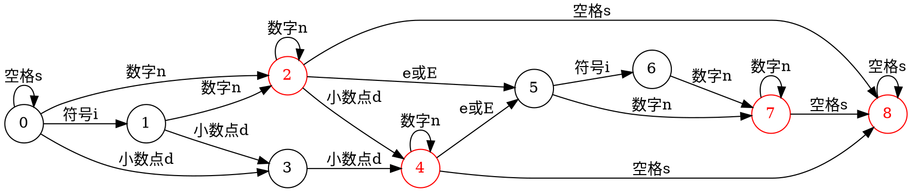

---
{"dg-publish":true,"permalink":"/其他/Graphviz/"}
---


Graphviz 是一个开源的图可视化工具，非常适合绘制结构化的图标和网络。Graphviz 使用一种叫 dot 的语言来表示图形。

大多数 Linux 发行版的包管理器都提供了二进制包，安装非常简单。如果想要在本地使用 Graphviz，安装之后新建一个文件编写脚本即可。

目前 dot 语言并没有很现代的辅助编写工具，而且我感觉这个语法也挺随意的。

下面结合我个人的使用经历，展示一下基本的用法。

## 绘制状态转移图



首先用 `digraph` 指定绘制有向图。`graph` 则是无向图。然后是图的名字。

默认状态下图是从上向下绘制的，通过指定 `rankdir = LR` ，将图转为从左到右。

然后设置节点的属性，先设置要特殊配置的节点，比如上面的 2 4 7 8，然后是其他节点。

`x -> y` 的 `x, y` 是节点的名字。后面 `label` 是从 `x` 转移到 `y` 的箭头上的字。

## 生成图片

使用命令

```shell
dot -Tpng tmp.dot -o tmp.png
```

生成 PNG 图像。dot 可以生成很多类型的文件，通过 `-T<type>` 的方式指定。

```
OUTPUT FORMATS
       Graphviz  uses an extensible plugin mechanism for its output renderers, so to see what output formats your installation of dot supports you can use ``dot -T:'' and check the warning message.  Also, The plugin mechanism supports multiple implementations of the output formats, allowing variations in the renderers and formatters.  To see what variants are available for a particular output format, use, for example: ``dot -Tpng:'' and to force a particular variant, use, for example: ``dot -Tpng:gd''

       Traditionally, Graphviz supports the following:
       -Tdot (Dot format containing layout information),
       -Txdot (Dot format containing complete layout information),
       -Tps (PostScript),
       -Tpdf (PDF),
       -Tsvg -Tsvgz (Structured Vector Graphics),
       -Tfig (XFIG graphics),
       -Tpng (png bitmap graphics),
       -Tgif (gif bitmap graphics),
       -Tjpg -Tjpeg (jpeg bitmap graphics),
       -Tjson (xdot information encoded in JSON),
       -Timap (imagemap files for httpd servers for each node or edge that has a non‐null href attribute.),
       -Tcmapx (client‐side imagemap for use in html and xhtml).
       Additional less common or more special‐purpose output formats can be found at https://www.graphviz.org/doc/info/output.html.
```

这里面并不都是图片格式。比如 `-Tdot, -Txdot, -Tcanon` 这些可以作为 dot 脚本的 formatter 来用。

上面的状态转移图生成的图片可以参考 [[其他/有限状态机的实现#状态转移图\|有限状态机的实现#状态转移图]] 。